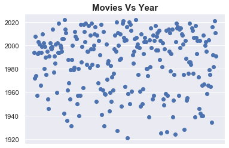
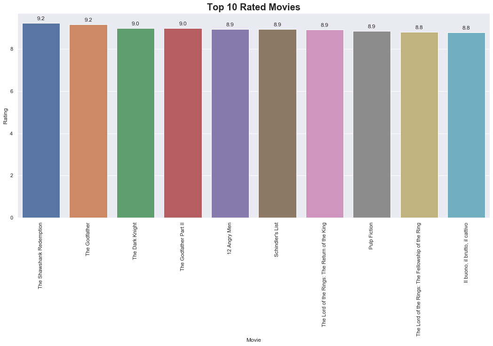
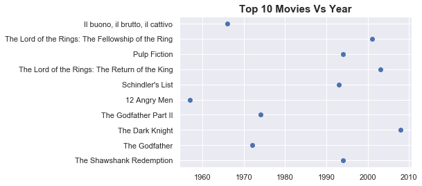
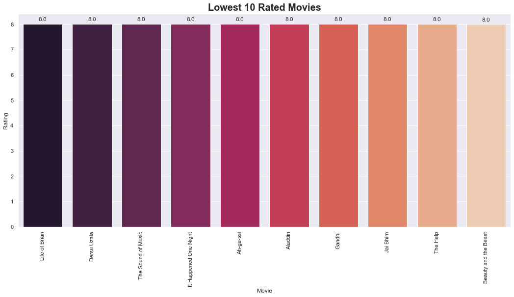
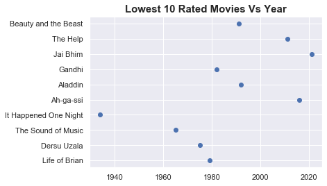

# Imbd-Scraping-Analysis
The data in the project is about the 250 most rated films on the imdb website, and the data contains the names of the films and also the year in which each film was released and evaluates those films and the names of the producers and the production team participating in these films
That data went through two stages, the first of which is the fetching of these data through scraping
The second is to analyze these data in order to understand them more and be simpler and easier to understand


```python
import pandas as pd 
import numpy as np
import matplotlib.pyplot as plt
import seaborn as sns

```


```python
data= pd.read_csv('imdb_top_250_movies.csv',index_col=0)
df=pd.DataFrame(data)
df
```


<div>
<style scoped>
    .dataframe tbody tr th:only-of-type {
        vertical-align: middle;
    }

    .dataframe tbody tr th {
        vertical-align: top;
    }

    .dataframe thead th {
        text-align: right;
    }
</style>
<table border="1" class="dataframe">
  <thead>
    <tr style="text-align: right;">
      <th></th>
      <th>movie_title</th>
      <th>rating</th>
      <th>year</th>
      <th>star_cast</th>
    </tr>
    <tr>
      <th>place</th>
      <th></th>
      <th></th>
      <th></th>
      <th></th>
    </tr>
  </thead>
  <tbody>
    <tr>
      <th>1</th>
      <td>The Shawshank Redemption</td>
      <td>9.233948</td>
      <td>1994</td>
      <td>Frank Darabont (dir.), Tim Robbins, Morgan Fre...</td>
    </tr>
    <tr>
      <th>2</th>
      <td>The Godfather</td>
      <td>9.156033</td>
      <td>1972</td>
      <td>Francis Ford Coppola (dir.), Marlon Brando, Al...</td>
    </tr>
    <tr>
      <th>3</th>
      <td>The Dark Knight</td>
      <td>8.985751</td>
      <td>2008</td>
      <td>Christopher Nolan (dir.), Christian Bale, Heat...</td>
    </tr>
    <tr>
      <th>4</th>
      <td>The Godfather Part II</td>
      <td>8.984212</td>
      <td>1974</td>
      <td>Francis Ford Coppola (dir.), Al Pacino, Robert...</td>
    </tr>
    <tr>
      <th>5</th>
      <td>12 Angry Men</td>
      <td>8.947841</td>
      <td>1957</td>
      <td>Sidney Lumet (dir.), Henry Fonda, Lee J. Cobb</td>
    </tr>
    <tr>
      <th>...</th>
      <td>...</td>
      <td>...</td>
      <td>...</td>
      <td>...</td>
    </tr>
    <tr>
      <th>246</th>
      <td>Aladdin</td>
      <td>8.006987</td>
      <td>1992</td>
      <td>Ron Clements (dir.), Scott Weinger, Robin Will...</td>
    </tr>
    <tr>
      <th>247</th>
      <td>Gandhi</td>
      <td>8.006329</td>
      <td>1982</td>
      <td>Richard Attenborough (dir.), Ben Kingsley, Joh...</td>
    </tr>
    <tr>
      <th>248</th>
      <td>Jai Bhim</td>
      <td>8.005430</td>
      <td>2021</td>
      <td>T.J. Gnanavel (dir.), Suriya, Lijo Mol Jose</td>
    </tr>
    <tr>
      <th>249</th>
      <td>The Help</td>
      <td>8.004665</td>
      <td>2011</td>
      <td>Tate Taylor (dir.), Emma Stone, Viola Davis</td>
    </tr>
    <tr>
      <th>250</th>
      <td>Beauty and the Beast</td>
      <td>8.002972</td>
      <td>1991</td>
      <td>Gary Trousdale (dir.), Paige O'Hara, Robby Benson</td>
    </tr>
  </tbody>
</table>
<p>250 rows × 4 columns</p>
</div>


```python
df.info()
```

    <class 'pandas.core.frame.DataFrame'>
    Int64Index: 250 entries, 1 to 250
    Data columns (total 4 columns):
     #   Column       Non-Null Count  Dtype  
    ---  ------       --------------  -----  
     0   movie_title  250 non-null    object 
     1   rating       250 non-null    float64
     2   year         250 non-null    int64  
     3   star_cast    250 non-null    object 
    dtypes: float64(1), int64(1), object(2)
    memory usage: 9.8+ KB
    


```python
df.duplicated().sum()
```


    0


```python
plt.scatter(df['movie_title'],df['year']).axes.get_xaxis().set_visible(False)
plt.title("Movies Vs Year",fontweight ='bold', fontsize = 15)

plt.show()
```





```python
ig = plt.figure(figsize = (18, 8))
splot=sns.barplot(x=df['movie_title'][:10],y=df['rating'][:10])
for p in splot.patches:
    splot.annotate(format(p.get_height(), '.1f'), 
                   (p.get_x() + p.get_width() / 2., p.get_height()), 
                   ha = 'center', va = 'center', 
                   xytext = (0, 9), 
                   textcoords = 'offset points')
plt.ylabel("Rating")
plt.xlabel("Movie")

plt.xticks(rotation=90)
splot.set_title("Top 10 Rated Movies",fontweight ='bold', fontsize = 20)

sns.set(font_scale =1)
```





```python
#sns.barplot(x=df['movie_title'][:10],y=df['year'][:10],palette="rocket")
x=df['year'][:10]
y=df['movie_title'][:10]
plt.title("Top 10 Movies Vs Year",fontweight ='bold', fontsize = 15)

plt.scatter(x,y)
plt.show()
```





```python
ig = plt.figure(figsize = (18, 8))
splot=sns.barplot(x=df['movie_title'][-10:],y=df['rating'][-10:],palette="rocket")
for p in splot.patches:
    splot.annotate(format(p.get_height(), '.1f'), 
                   (p.get_x() + p.get_width() / 2., p.get_height()), 
                   ha = 'center', va = 'center', 
                   xytext = (0, 9), 
                   textcoords = 'offset points')
plt.ylabel("Rating")
plt.xlabel("Movie")

plt.xticks(rotation=90)
splot.set_title("Lowest 10 Rated Movies",fontweight ='bold', fontsize = 20)

sns.set(font_scale =1)
```





```python
x=df['year'][-10:]
y=df['movie_title'][-10:]
plt.title("Lowest 10 Rated Movies Vs Year",fontweight ='bold', fontsize = 15)

plt.scatter(x,y)
plt.show()
```





```python
df["star_cast"].value_counts().head()
```


    Peter Jackson (dir.), Elijah Wood, Ian McKellen                2
    Richard Linklater (dir.), Ethan Hawke, Julie Delpy             2
    Charles Chaplin (dir.), Charles Chaplin, Paulette Goddard      2
    James Cameron (dir.), Arnold Schwarzenegger, Linda Hamilton    2
    Hayao Miyazaki (dir.), Chieko Baishô, Takuya Kimura            1
    Name: star_cast, dtype: int64


# Most 5 Star Cast In Top 250 Movies

<table style="width:100%">
<tr>
<th>star_cast</th>
<th>Number Thier Works</th>
</tr>

<tr>
<td>Peter Jackson (dir.), Elijah Wood, Ian McKellen</td>
<td>2</td>
</tr>

<tr>
<td> Richard Linklater (dir.), Ethan Hawke, Julie Delpy</td>
<td>2</td>
</tr>
    
<tr>
<td>Charles Chaplin (dir.), Charles Chaplin, Paulette Goddard</td>
<td>2</td>
</tr>

<tr>
<td>James Cameron (dir.), Arnold Schwarzenegger, Linda Hamilton</td>
<td>2</td>
</tr>
    
<tr>
<td>Hayao Miyazaki (dir.), Chieko Baishô, Takuya Kimura</td>
<td>1</td>
</tr>
</table>


```python

```
